# Federated Imputation Architecture Diagram

## High-Level System Architecture (Mermaid)

```mermaid
graph TB
    subgraph USER["👤 USER LAYER"]
        Browser[Web Browser]
        Frontend[React Frontend<br/>Port 3000<br/>Material-UI]
    end

    subgraph GATEWAY["🚪 API GATEWAY"]
        APIGateway[API Gateway<br/>Port 8000<br/>FastAPI<br/>----<br/>JWT Auth<br/>Rate Limiting<br/>Request Routing]
    end

    subgraph SERVICES["⚙️ MICROSERVICES"]
        UserSvc[👥 User Service<br/>Port 8001<br/>----<br/>Auth & Credentials]
        SvcReg[🔍 Service Registry<br/>Port 8002<br/>----<br/>Health Checks<br/>Discovery]
        JobProc[⚡ Job Processor<br/>Port 8003<br/>----<br/>Celery Queue<br/>Status Tracking]
        FileMgr[📁 File Manager<br/>Port 8004<br/>----<br/>Upload/Download]
        Notif[🔔 Notification<br/>Port 8005<br/>----<br/>Email/WebSocket]
        Monitor[📊 Monitoring<br/>Port 8006<br/>----<br/>Dashboard Stats]
    end

    subgraph DATA["💾 DATA LAYER"]
        Postgres[(PostgreSQL<br/>7 Databases)]
        Redis[(Redis<br/>Cache & Queue)]
    end

    subgraph WORKERS["🐝 ASYNC WORKERS"]
        CeleryW[Celery Worker<br/>Job Processing]
        CeleryB[Celery Beat<br/>Scheduled Tasks]
    end

    subgraph EXTERNAL["🌍 EXTERNAL SERVICES"]
        ILIFU[🏢 H3Africa ILIFU<br/>Cape Town, SA<br/>Status: Online ✓<br/>Score: 87/100]
        Mali[🏢 H3Africa Mali<br/>Bamako, Mali<br/>Status: Timeout ⏱<br/>Score: 25/100]
        Michigan[☁️ Michigan Server<br/>Ann Arbor, MI<br/>Status: Online ✓<br/>Score: 92/100]
        DNAstack[☁️ DNAstack Azure<br/>DRS + WesKIT<br/>Status: Online ✓<br/>Score: 78/100]
    end

    Browser --> Frontend
    Frontend -->|HTTP/REST| APIGateway

    APIGateway -->|/api/auth/*| UserSvc
    APIGateway -->|/api/services/*| SvcReg
    APIGateway -->|/api/jobs/*| JobProc
    APIGateway -->|/api/files/*| FileMgr
    APIGateway -->|/api/notifications/*| Notif
    APIGateway -->|/api/dashboard/*| Monitor

    UserSvc -.->|user_db| Postgres
    SvcReg -.->|service_db| Postgres
    JobProc -.->|job_db| Postgres
    FileMgr -.->|file_db| Postgres
    Notif -.->|notif_db| Postgres
    Monitor -.->|monitor_db| Postgres

    APIGateway -.-> Redis
    JobProc -->|Queue Jobs| Redis
    Redis --> CeleryW
    CeleryB --> Redis

    CeleryW -->|Submit Jobs| ILIFU
    CeleryW -->|Submit Jobs| Mali
    CeleryW -->|Submit Jobs| Michigan
    CeleryW -->|Submit Jobs| DNAstack

    SvcReg -->|Health Check| ILIFU
    SvcReg -->|Health Check| Mali
    SvcReg -->|Health Check| Michigan
    SvcReg -->|Health Check| DNAstack

    Notif -.->|WebSocket| Frontend

    classDef frontend fill:#61dafb,stroke:#20232a,stroke-width:3px
    classDef gateway fill:#ff6b6b,stroke:#c92a2a,stroke-width:3px
    classDef service fill:#4dabf7,stroke:#1971c2,stroke-width:2px
    classDef database fill:#51cf66,stroke:#2f9e44,stroke-width:2px
    classDef worker fill:#ffd43b,stroke:#f08c00,stroke-width:2px
    classDef external fill:#e599f7,stroke:#9c36b5,stroke-width:2px

    class Frontend,Browser frontend
    class APIGateway gateway
    class UserSvc,SvcReg,JobProc,FileMgr,Notif,Monitor service
    class Postgres,Redis database
    class CeleryW,CeleryB worker
    class ILIFU,Mali,Michigan,DNAstack external
```

## Job Submission Flow (Sequence Diagram)

## Service Discovery & Ranking

```mermaid
graph LR
    subgraph Input["User Request"]
        Req[User searches<br/>for services<br/>----<br/>Filters:<br/>• Location<br/>• Resources<br/>• Service Type]
    end

    subgraph Scoring["Service Scoring (0-100 pts)"]
        Health[Health Status<br/>60 points<br/>----<br/>Online: 60<br/>Timeout: 25<br/>Unhealthy: 10<br/>Inactive: 0]

        Distance[Geographic Distance<br/>20 points<br/>----<br/>Haversine Formula<br/>Closer = Higher Score]

        Response[Response Time<br/>10 points<br/>----<br/>Faster = Higher<br/>Only for healthy]

        Resources[Resources Available<br/>10 points<br/>----<br/>CPU/Memory/Storage<br/>Null = Assume Available]
    end

    subgraph Result["Ranked Results"]
        Rank[1. Michigan: 92/100 ✓<br/>2. ILIFU: 87/100 ✓<br/>3. DNAstack: 78/100 ✓<br/>4. Mali: 25/100 ⏱]
    end

    Req --> Health
    Req --> Distance
    Req --> Response
    Req --> Resources

    Health --> Result
    Distance --> Result
    Response --> Result
    Resources --> Result

    classDef input fill:#4dabf7,stroke:#1971c2,stroke-width:2px
    classDef scoring fill:#ffd43b,stroke:#f08c00,stroke-width:2px
    classDef result fill:#51cf66,stroke:#2f9e44,stroke-width:2px

    class Req input
    class Health,Distance,Response,Resources scoring
    class Rank result
```

## Database Schema (Entity Relationship)

## How to Use These Diagrams

### Option 1: View in GitHub
1. This file is already in Markdown format
2. GitHub will automatically render the Mermaid diagrams
3. Just push to your repository and view on GitHub

### Option 2: Mermaid Live Editor
1. Go to https://mermaid.live
2. Copy any diagram code block above
3. Paste into the editor
4. Export as PNG or SVG

### Option 3: VS Code Preview
1. Install "Markdown Preview Mermaid Support" extension
2. Open this file in VS Code
3. Press `Ctrl+Shift+V` to preview
4. Right-click diagram → "Copy Mermaid as Image"

### Option 4: Export to draw.io
1. Use mermaid-to-drawio converter
2. Or redraw in draw.io for more customization

## Legend

- 🚪 = Gateway/Entry Point
- ⚙️ = Microservices
- 💾 = Data Storage
- 🐝 = Background Workers
- 🌍 = External Services
- ✓ = Online/Healthy
- ⏱ = Timeout/Slow
- ✗ = Offline/Unhealthy
