# Professional Diagram Tools Guide

## 🎨 Best Tools for Architecture Diagrams

### 1. **Mermaid Live Editor** ⭐ (Recommended for Code-Based)
**URL:** https://mermaid.live

**Pros:**
- ✅ Version controlled (text-based)
- ✅ GitHub auto-renders
- ✅ Fast iterations
- ✅ Export PNG/SVG
- ✅ No account needed

**Best For:** Technical diagrams, sequence flows, ER diagrams

**Quick Start:**
```bash
# 1. Copy diagram code from ARCHITECTURE_DIAGRAM.md
# 2. Go to https://mermaid.live
# 3. Paste code
# 4. Click "Actions" → "Export" → PNG/SVG
```

### 2. **Excalidraw** ⭐ (Recommended for Hand-Drawn Style)
**URL:** https://excalidraw.com

**Pros:**
- ✅ Beautiful hand-drawn aesthetic
- ✅ Real-time collaboration
- ✅ Simple and intuitive
- ✅ Export to PNG/SVG
- ✅ No account needed

**Best For:** Whiteboard-style sketches, brainstorming, presentations

### 3. **draw.io (diagrams.net)** ⭐ (Recommended for Professional)
**URL:** https://app.diagrams.net

**Pros:**
- ✅ Most comprehensive features
- ✅ Lots of templates (AWS, Azure, GCP)
- ✅ VS Code integration
- ✅ Export many formats
- ✅ Free and open source

**Best For:** Enterprise architecture, cloud diagrams, detailed technical docs

### 4. **Terrastruct (D2 Language)**
**URL:** https://play.d2lang.com

**Pros:**
- ✅ Modern syntax
- ✅ Auto-layout algorithms
- ✅ Beautiful styling
- ✅ Code-based

**Best For:** Software architecture, system design diagrams

### 5. **PlantUML**
**URL:** https://www.plantuml.com/plantuml/uml/

**Pros:**
- ✅ Powerful syntax
- ✅ Many diagram types
- ✅ CI/CD integration
- ✅ Version controlled

**Best For:** UML diagrams, sequence diagrams, component diagrams

---

## 📊 Ready-to-Use Templates

### Template 1: Mermaid (Copy to https://mermaid.live)

```mermaid
graph TB
    subgraph AZURE["☁️ AZURE"]
        DNS[DNAstack<br/>DRS/WesKIT]
        AZ_DOCKER[Docker]
        DNS --> AZ_DOCKER
    end

    subgraph MALI["🏢 MALI"]
        MALI_DRS[DRS]
        MALI_WES[WesKIT]
        MALI_NF[NEXTFLOW<br/>Docker]
        MALI_DRS --> MALI_NF
        MALI_WES --> MALI_NF
    end

    subgraph ILIFU["🏢 ILIFU"]
        ILIFU_DRS[DRS/WesKIT]
        ILIFU_ATT[Attestation<br/>Data SPA]
        ILIFU_DRS --> ILIFU_ATT
    end

    subgraph CENTRAL["🖥️ CENTRAL"]
        UI[UI<br/>React]
        DB[(PostgreSQL)]
        UI --> DB
    end

    AZ_DOCKER -->|WesKIT| UI
    MALI_NF -->|Data| UI
    ILIFU_ATT -->|Auth| UI

    classDef azure fill:#1E90FF,stroke:#000,stroke-width:3px
    classDef onprem fill:#32CD32,stroke:#000,stroke-width:3px
    classDef central fill:#FFD700,stroke:#000,stroke-width:4px

    class AZURE,DNS,AZ_DOCKER azure
    class MALI,MALI_DRS,MALI_WES,MALI_NF,ILIFU,ILIFU_DRS,ILIFU_ATT onprem
    class CENTRAL,UI,DB central
```



### Template 2: D2 Language (Copy to https://play.d2lang.com)

```d2
direction: right

azure: "☁️ AZURE" {
  dnastack: "DNAstack\nDRS/WesKIT" {
    shape: rectangle
    style.fill: "#1E90FF"
  }
  docker: "Docker" {
    shape: rectangle
    style.fill: "#1E90FF"
  }
  dnastack -> docker
}

mali: "🏢 MALI (On-Prem)" {
  drs: "DRS" {
    shape: rectangle
    style.fill: "#32CD32"
  }
  weskit: "WesKIT" {
    shape: rectangle
    style.fill: "#32CD32"
  }
  nextflow: "NEXTFLOW\nDocker" {
    shape: rectangle
    style.fill: "#32CD32"
  }
  drs -> nextflow
  weskit -> nextflow
}

ilifu: "🏢 ILIFU (On-Prem)" {
  drs_wes: "DRS/WesKIT" {
    shape: rectangle
    style.fill: "#32CD32"
  }
  attestation: "Attestation\nData SPA" {
    shape: rectangle
    style.fill: "#32CD32"
  }
  drs_wes -> attestation
}

central: "🖥️ CENTRAL UI" {
  ui: "React Frontend" {
    shape: rectangle
    style.fill: "#FFD700"
  }
  db: "PostgreSQL" {
    shape: cylinder
    style.fill: "#FFD700"
  }
  ui -> db
}

azure.docker -> central.ui: "WesKIT"
mali.nextflow -> central.ui: "Data Flow"
ilifu.attestation -> central.ui: "Attestation"
```

### Template 3: PlantUML (Copy to https://plantuml.com)

```plantuml
@startuml
!define AZURE #1E90FF
!define ONPREM #32CD32
!define CENTRAL #FFD700

package "☁️ AZURE" AZURE {
  [DNAstack\nDRS/WesKIT] as dns
  [Docker] as az_docker
  dns --> az_docker
}

package "🏢 MALI (On-Prem)" ONPREM {
  [DRS] as mali_drs
  [WesKIT] as mali_wes
  [NEXTFLOW\nDocker] as mali_nf
  mali_drs --> mali_nf
  mali_wes --> mali_nf
}

package "🏢 ILIFU (On-Prem)" ONPREM {
  [DRS/WesKIT] as ilifu_drs
  [Attestation\nData SPA] as ilifu_att
  ilifu_drs --> ilifu_att
}

package "🖥️ CENTRAL UI" CENTRAL {
  [React Frontend] as ui
  database "PostgreSQL" as db
  ui --> db
}

az_docker -down-> ui : WesKIT
mali_nf -down-> ui : Data Flow
ilifu_att -down-> ui : Attestation

@enduml
```



---

## 🚀 Step-by-Step: Creating Your Diagram

### Method 1: Mermaid Live (Fastest)

1. **Open Browser:** https://mermaid.live
2. **Clear Editor:** Select all (Ctrl+A) and delete
3. **Paste Code:** Copy template from above
4. **Customize:** Edit text, colors, connections
5. **Export:**
   - Click "Actions" → "Export"
   - Choose PNG (for docs) or SVG (for scaling)
6. **Save:** Download to `/docs/diagrams/`

### Method 2: Excalidraw (Prettiest)

1. **Open Browser:** https://excalidraw.com
2. **Start Drawing:**
   - Use Rectangle tool for boxes
   - Use Arrow tool for connections
   - Use Text tool for labels
3. **Style:**
   - Select elements → Change colors
   - Add icons/emojis
   - Adjust stroke width
4. **Export:**
   - Menu → Export → PNG/SVG
   - Check "Background" for white bg

### Method 3: draw.io (Most Professional)

1. **Open Browser:** https://app.diagrams.net
2. **Choose Storage:**
   - "Device" (local)
   - "GitHub" (save to repo)
   - "Google Drive" (cloud)
3. **Select Template:**
   - Search "cloud architecture"
   - Or start blank
4. **Build Diagram:**
   - Drag shapes from left panel
   - Use connectors between shapes
   - Style with top toolbar
5. **Export:**
   - File → Export as → PNG/SVG/PDF
   - Choose resolution (2x for high quality)

---

## 🎯 Recommended Workflow

### For Your Project:

**1. High-Level Overview (Use Excalidraw)**
- Hand-drawn style matches your whiteboard
- Great for presentations and documentation
- Quick iterations

**2. Technical Architecture (Use Mermaid)**
- Version controlled with git
- Auto-renders on GitHub
- Easy to update

**3. Detailed Diagrams (Use draw.io)**
- Professional enterprise look
- Integrate AWS/Azure/GCP icons
- Multiple diagram types

---

## 📁 Where to Save Diagrams

```bash
federated-imputation-central/
├── docs/
│   ├── diagrams/               # ← Create this folder
│   │   ├── architecture.png
│   │   ├── architecture.svg
│   │   ├── job-flow.png
│   │   ├── service-discovery.png
│   │   └── README.md           # Credits and sources
│   ├── ARCHITECTURE_DIAGRAM.md  # Mermaid source
│   └── SIMPLE_ARCHITECTURE.md   # Simple view
```

**Create diagrams folder:**
```bash
mkdir -p docs/diagrams
```

---

## 🔗 Quick Links

| Tool | URL | Best For |
|------|-----|----------|
| **Mermaid Live** | https://mermaid.live | Code-based, version controlled |
| **Excalidraw** | https://excalidraw.com | Hand-drawn, presentations |
| **draw.io** | https://app.diagrams.net | Professional, enterprise |
| **D2 Playground** | https://play.d2lang.com | Modern syntax, auto-layout |
| **PlantUML** | https://plantuml.com | UML, sequence diagrams |
| **Structurizr** | https://structurizr.com | C4 model diagrams |
| **Kroki** | https://kroki.io | Multi-format converter |

---

## 💡 Pro Tips

### 1. **Color Coding**
```
Cloud Services:     Blue (#1E90FF)
On-Premise:         Green (#32CD32)
Central System:     Gold (#FFD700)
External APIs:      Red (#FF6347)
Databases:          Purple (#9370DB)
```

### 2. **Icon Resources**
- **Font Awesome:** https://fontawesome.com (emoji-style: `fa:fa-cloud`)
- **Simple Icons:** https://simpleicons.org (brand icons)
- **Noun Project:** https://thenounproject.com (generic icons)

### 3. **Export Settings**
- **PNG:** Use 2x or 3x scale for presentations
- **SVG:** Best for scaling, smaller file size
- **PDF:** For print documentation
- **JSON:** Save source for re-editing

### 4. **Collaboration**
- **Excalidraw:** Share live link for real-time collaboration
- **draw.io:** Save to GitHub for version control
- **Mermaid:** Include in README for automatic rendering

---

## 🎓 Learning Resources

**Mermaid:**
- Docs: https://mermaid.js.org
- Live Examples: https://mermaid.live/examples

**D2:**
- Tour: https://d2lang.com/tour/intro
- Playground: https://play.d2lang.com

**PlantUML:**
- Guide: https://plantuml.com/guide
- Reference: https://plantuml.com/sitemap-language-specification

**draw.io:**
- Video Tutorials: https://www.drawio.com/blog
- Template Library: Built-in (left sidebar)

---

## ✨ Next Steps

1. **Choose Your Tool** based on use case
2. **Copy Template** from this guide
3. **Customize** for your architecture
4. **Export** to `docs/diagrams/`
5. **Link** in documentation
6. **Update** as system evolves

**Quick Command:**
```bash
# Create diagrams directory
mkdir -p docs/diagrams

# Add to git
git add docs/diagrams/
git commit -m "docs: Add architecture diagrams"
```
