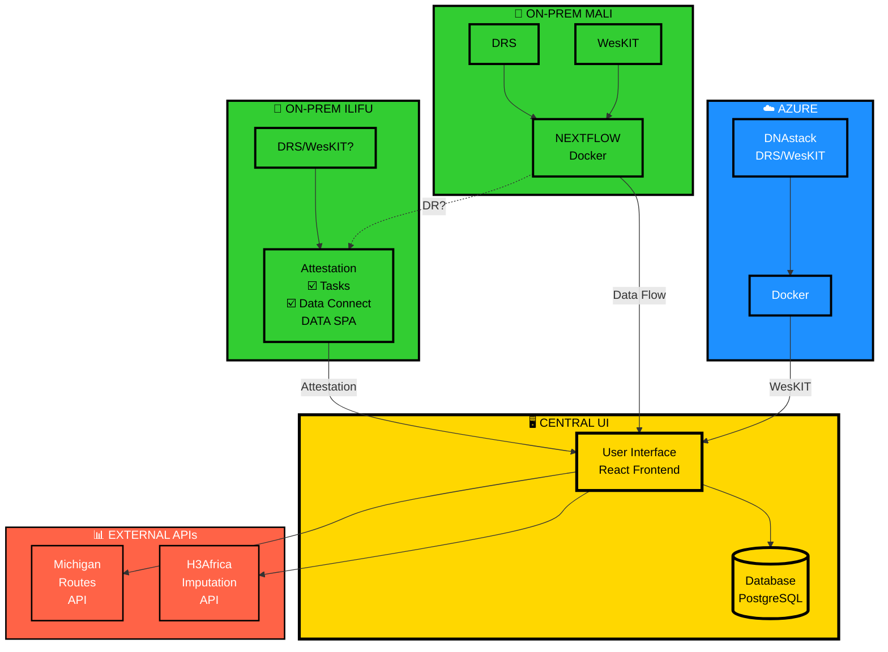

# Federated Imputation - Simple Architecture

## High-Level Conceptual View (Like Your Whiteboard)



## Simplified System Flow

```
┌─────────────────────────────────────────────────────────────────┐
│                     FEDERATED ARCHITECTURE                      │
└─────────────────────────────────────────────────────────────────┘

    CLOUD SITES                 CENTRAL HUB           ON-PREMISES

┌─────────────┐              ┌─────────────┐        ┌─────────────┐
│   AZURE     │              │             │        │    MALI     │
│             │              │   CENTRAL   │        │             │
│  DNAstack   │─────────────▶│     UI      │◀───────│ DRS+WesKIT  │
│  DRS/WesKIT │   WesKIT     │             │  Data  │  Nextflow   │
│   Docker    │              │  • React    │  Flow  │   Docker    │
│             │              │  • Database │        │             │
└─────────────┘              │  • APIs     │        └─────────────┘
                             │             │
┌─────────────┐              └──────┬──────┘        ┌─────────────┐
│  MICHIGAN   │                     │               │    ILIFU    │
│             │                     │               │             │
│ Imputation  │◀────────────────────┤               │ DRS/WesKIT  │
│   Server    │      API Calls      │               │             │
│             │                     │               │ Attestation │
└─────────────┘                     │               │ Data SPA    │
                                    │               │             │
┌─────────────┐                     │               └─────────────┘
│  H3AFRICA   │                     │                      ▲
│             │                     │                      │
│ Historical  │◀────────────────────┘                      │
│  Impute API │                                    Data Residency?
│             │                                            │
└─────────────┘                                   ─────────┘


KEY CONCEPTS:
═════════════

🌍 FEDERATED MODEL
   • Central UI coordinates jobs
   • Data stays at source institutions (Mali, ILIFU)
   • Computation happens at remote sites
   • Results flow back to central

☁️ CLOUD vs ON-PREMISE
   • Azure: Cloud-based DNAstack with Docker
   • Mali: On-premises with Nextflow workflow
   • ILIFU: On-premises with attestation/governance

📊 WORKFLOW ENGINES
   • DRS: Data Repository Service (GA4GH standard)
   • WesKIT: Workflow Execution Service
   • Nextflow: Workflow orchestration
   • Docker: Containerized execution

🔐 DATA GOVERNANCE
   • Attestation: User verification for data access
   • Tasks: Compliance checkpoints
   • Data Connect: Secure data federation
   • DR (Data Residency): Where data physically resides
```

## What This Architecture Does

**1. USER SUBMITS JOB** at Central UI
   ↓
**2. CENTRAL ROUTES** job to appropriate service:
   - Azure DNAstack (cloud)
   - Mali H3Africa (on-prem Africa)
   - ILIFU H3Africa (on-prem South Africa)
   - Michigan Server (cloud USA)
   ↓
**3. SERVICE EXECUTES** imputation on their infrastructure:
   - DNAstack uses WesKIT → Docker
   - Mali uses DRS → WesKIT → Nextflow → Docker
   - ILIFU uses DRS/WesKIT → Attestation → Data SPA
   ↓
**4. RESULTS RETURN** to Central UI
   ↓
**5. USER DOWNLOADS** results

## Comparison to Your Whiteboard

**Your Sketch Shows:**
- ✅ Azure (DNAstack with DRS/WesKIT/Docker)
- ✅ Mali on-prem (DRS, WesKIT, Nextflow/Docker)
- ✅ ILIFU on-prem (DRS/WesKIT?, Attestation, Data SPA)
- ✅ Central UI coordinating everything
- ✅ External APIs (H3Africa Impute, Michigan Routes)
- ✅ Data residency question (DR?) between Mali and ILIFU

**This Matches the Federated Pattern:**
```
Multiple compute sites → Central coordinator → User interface
     (do the work)         (orchestrates)        (submits/views)
```

The "DR?" line in your sketch likely refers to **Data Residency** compliance -
ensuring Mali data doesn't leave Africa and stays compliant with regulations
like POPIA (Protection of Personal Information Act).
