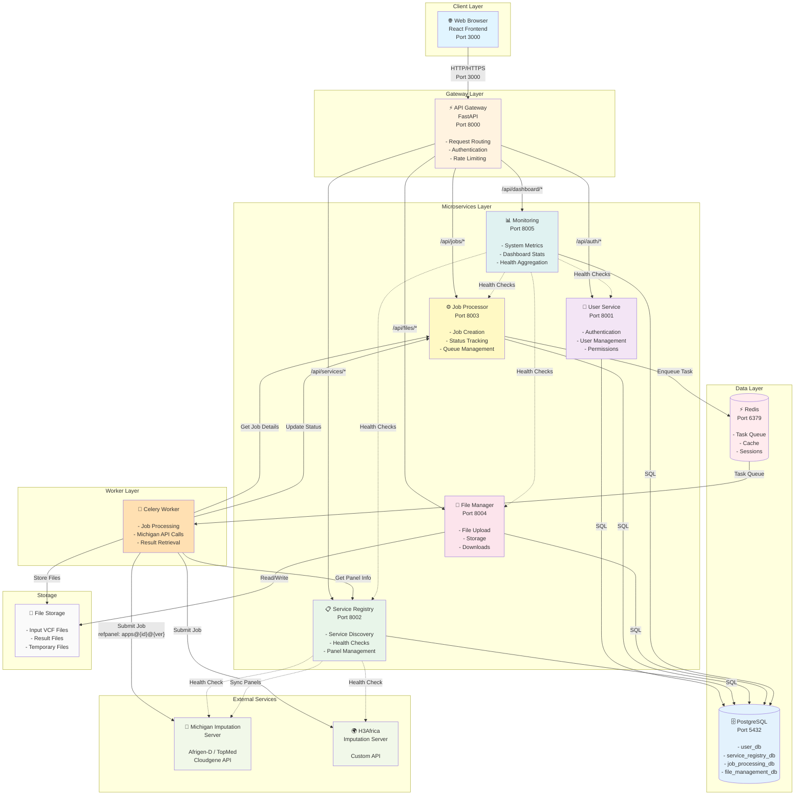
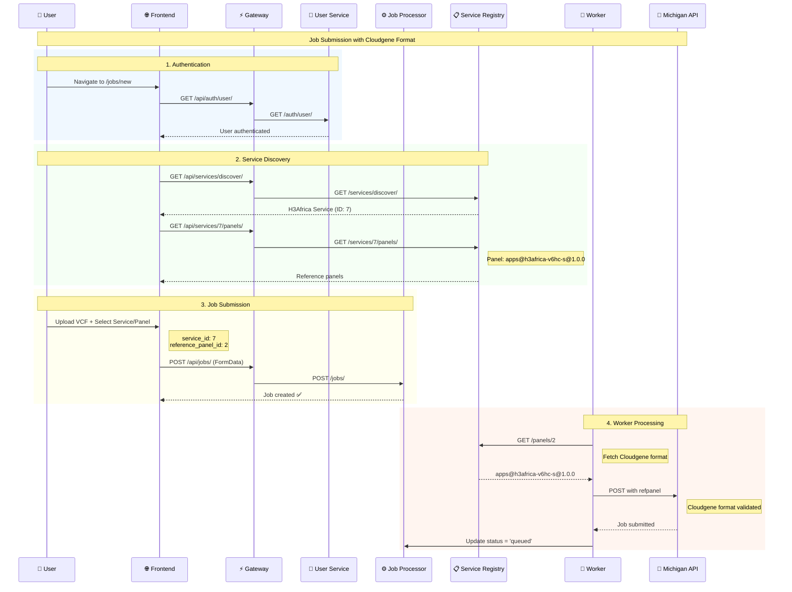
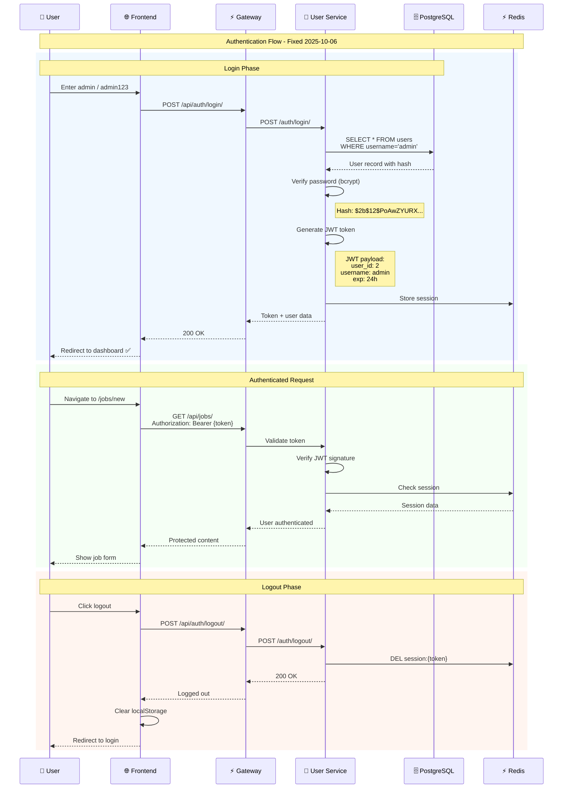

# Architecture Diagrams - Preview

**Open this file in VS Code and press `Ctrl+Shift+V` to preview all diagrams!**

---

## 1. Architecture Overview

Complete system architecture with all microservices, data layers, and external APIs.



---

## 2. Job Submission Flow

Complete job submission workflow from user login to Michigan API submission.

**Key Details:** Shows correct field names (`service_id`, `reference_panel_id`) and Cloudgene format handling.



---

## 3. Authentication Flow

Login workflow with JWT generation and session management.

**Credentials:** admin / admin123 (Fixed 2025-10-06)



---

## 4. Michigan API Integration

Complete Michigan imputation workflow with Cloudgene format validation.

**Critical:** Panel format must be `apps@{app-id}@{version}`

```mermaid
graph LR
    A[👤 User Form] -->|service_id, reference_panel_id| B[⚙️ Job Processor]
    B -->|Validate Fields ✅| C[💾 Create Job Record]
    C -->|Enqueue Task| D[🔄 Celery Worker]
    D -->|GET /panels/2| E[📋 Service Registry]
    E -->|Return Panel Data| F[🔍 Extract Cloudgene Format]
    F -->|apps@h3africa-v6hc-s@1.0.0| G[🔧 Build API Params]
    G -->|POST refpanel| H[🧬 Michigan API]
    H -->|Validate Format ✅| I[⏳ Queue Job]
    I -->|Return Job ID| J[📊 Update Status]

    style A fill:#e3f2fd,stroke:#1976d2,stroke-width:2px
    style E fill:#c8e6c9,stroke:#4caf50,stroke-width:2px
    style F fill:#fff9c4,stroke:#fbc02d,stroke-width:2px
    style H fill:#f1f8e9,stroke:#689f38,stroke-width:2px
```

**Critical Fixes:**
- ✅ Fix #1: Frontend field names → `service_id`, `reference_panel_id` (NewJob.tsx:286-287)
- ✅ Fix #2: Panel database stores Cloudgene format → `apps@h3africa-v6hc-s@1.0.0`
- ✅ Fix #3: Worker extracts panel name from Service Registry

---

## Viewing Options

### Option 1: VS Code Preview (This File!)
```bash
code docs/diagrams/DIAGRAMS_PREVIEW.md
# Press Ctrl+Shift+V to preview with rendered diagrams
```

### Option 2: Web Browser (Best!)
```bash
# Access at:
http://154.114.10.123:8888/view-diagrams.html
```

### Option 3: Mermaid Live Editor
```bash
# Copy diagram code and paste at:
https://mermaid.live
```

---

## System Status Summary

**As of 2025-10-06 13:03 UTC:**

✅ **Frontend:** Up, compiled successfully (Port 3000)
✅ **API Gateway:** Healthy (Port 8000)
✅ **User Service:** Healthy, authentication working (Port 8001)
✅ **Service Registry:** Healthy, 2 panels configured (Port 8002)
✅ **Job Processor:** Running, Michigan integration ready (Port 8003)
✅ **PostgreSQL:** 4 databases operational
✅ **Redis:** Task queue & sessions active

**Issues Resolved:**
- ✅ Frontend TypeScript errors (0 compilation errors)
- ✅ Authentication 403 errors (admin/admin123 working)
- ✅ Job submission HTTP 422 errors (field names fixed)

**Ready for Testing:**
- Login: http://154.114.10.123:3000 (admin/admin123)
- Job Submission: http://154.114.10.123:3000/jobs/new
- Michigan API: Cloudgene format support deployed

---

**Documentation:**
- [FIXES_COMPLETED_2025-10-06.md](../../FIXES_COMPLETED_2025-10-06.md)
- [DEPLOYMENT_STATUS_2025-10-06.md](../../DEPLOYMENT_STATUS_2025-10-06.md)
- [HOW_TO_VIEW.md](HOW_TO_VIEW.md)
- [DIAGRAMS_CREATED_2025-10-06.md](../../DIAGRAMS_CREATED_2025-10-06.md)
