# Federated Genomic Imputation Platform - Overview

## Central UI Coordinating Multiple Imputation Services

This diagram shows the high-level architecture of the Federated Genomic Imputation Platform, emphasizing the **central coordinating UI** that connects users to multiple imputation services.

---

## Architecture Diagram

```mermaid
graph TB
    subgraph "🖥️ CENTRAL PLATFORM"
        UI["<b>Central Web UI</b><br/>React Frontend<br/>http://154.114.10.123:3000<br/><br/>User Authentication ✅<br/>Job Submission ✅<br/>Service Discovery ✅<br/>Result Management"]

        Gateway["<b>API Gateway</b><br/>Port 8000<br/><br/>Request Routing<br/>Load Balancing<br/>Authentication"]

        Backend["<b>Backend Services</b><br/><br/>• User Service (Port 8001)<br/>• Service Registry (Port 8002)<br/>• Job Processor (Port 8003)<br/>• File Manager (Port 8004)<br/>• Monitoring (Port 8005)"]

        DB[("<b>Central Database</b><br/>PostgreSQL<br/><br/>• User accounts<br/>• Job metadata<br/>• Service catalog<br/>• Results index")]

        Queue[("<b>Task Queue</b><br/>Redis + Celery<br/><br/>Job orchestration<br/>Async processing")]
    end

    subgraph "☁️ CLOUD IMPUTATION SERVICES"
        Michigan["<b>🧬 Michigan Imputation Server</b><br/>https://impute.afrigen-d.org<br/><br/><b>Type:</b> Michigan/TopMed<br/><b>Format:</b> Cloudgene API<br/><b>Status:</b> ✅ Integrated<br/><br/><b>Reference Panels:</b><br/>• 1000 Genomes Phase 3 (v5)<br/>• H3Africa (v6) - 4,447 samples<br/>• HapMap 2<br/>• CAAPA<br/><br/><b>Features:</b><br/>• Quality Control<br/>• Phasing (Eagle2)<br/>• Imputation (Minimac4)<br/>• GRCh37/GRCh38 support"]

        H3Africa["<b>🌍 H3Africa Imputation Server</b><br/>Legacy Historical Service<br/><br/><b>Type:</b> Custom API<br/><b>Status:</b> Available<br/><br/><b>Reference Panels:</b><br/>• African populations<br/>• H3Africa consortium data<br/><br/><b>Features:</b><br/>• African-specific panels<br/>• Historical job support"]
    end

    subgraph "🏢 ON-PREMISE SERVICES"
        Mali["<b>📍 MALI Site</b><br/>West Africa Regional Hub<br/><br/><b>Infrastructure:</b><br/>• DRS (Data Repository Service)<br/>• WesKIT (Workflow Execution)<br/>• Nextflow pipelines<br/>• Local Docker compute<br/><br/><b>Data:</b><br/>• Local genomic datasets<br/>• Regional reference data<br/><br/><b>Status:</b> Planned"]

        ILIFU["<b>📍 ILIFU Site</b><br/>South Africa HPC<br/><br/><b>Infrastructure:</b><br/>• DRS/WesKIT<br/>• Attestation services<br/>• Data SPA integration<br/>• HPC compute cluster<br/><br/><b>Data:</b><br/>• Secure data hosting<br/>• Privacy-preserving compute<br/><br/><b>Status:</b> Planned"]

        Azure["<b>☁️ Azure Site</b><br/>Cloud Compute<br/><br/><b>Infrastructure:</b><br/>• DNAstack platform<br/>• DRS/WesKIT<br/>• Docker containers<br/>• Scalable compute<br/><br/><b>Features:</b><br/>• Cloud-native workflows<br/>• Auto-scaling<br/><br/><b>Status:</b> Planned"]
    end

    subgraph "👥 USER INTERACTION"
        Researcher["<b>👨‍🔬 Researcher</b><br/><br/>• Upload VCF files<br/>• Select imputation service<br/>• Choose reference panel<br/>• Configure parameters<br/>• Monitor job progress<br/>• Download results"]
    end

    Researcher -->|"1. Access Web Interface"| UI
    UI -->|"2. Authenticate & Route"| Gateway
    Gateway -->|"3. Process Requests"| Backend
    Backend -->|"4. Store Metadata"| DB
    Backend -->|"5. Queue Jobs"| Queue

    Queue -->|"6. Submit Job<br/>(Cloudgene Format)"| Michigan
    Queue -->|"Submit Job<br/>(Custom API)"| H3Africa
    Queue -.->|"Future: WesKIT"| Mali
    Queue -.->|"Future: WesKIT"| ILIFU
    Queue -.->|"Future: DNAstack"| Azure

    Michigan -->|"7. Results"| Queue
    H3Africa -->|"Results"| Queue
    Queue -->|"9. Update Status"| Backend
    Backend -->|"10. Store Metadata"| DB
    UI -->|"11. Notify User"| Researcher

    Backend -->|"Health Checks"| Michigan
    Backend -->|"Health Checks"| H3Africa

    style UI fill:#FFD700,stroke:#000,stroke-width:4px
    style Gateway fill:#FFA500,stroke:#000,stroke-width:3px
    style Michigan fill:#32CD32,stroke:#000,stroke-width:3px
    style H3Africa fill:#3CB371,stroke:#000,stroke-width:3px
    style Mali fill:#87CEEB,stroke:#000,stroke-width:2px,stroke-dasharray: 5 5
    style ILIFU fill:#87CEEB,stroke:#000,stroke-width:2px,stroke-dasharray: 5 5
    style Azure fill:#87CEEB,stroke:#000,stroke-width:2px,stroke-dasharray: 5 5
```



---

## Key Architecture Principles

### 🎯 Central Coordination Model

**The Central Platform acts as a unified hub that:**

- Provides a **single web interface** for all imputation services
- Manages **user authentication** and authorization
- Maintains a **service registry** of available imputation servers
- **Orchestrates job submission** to appropriate services
- **Tracks job status** across multiple services
- **Aggregates results** for easy user access

### 🌍 Federated Service Integration

**Currently Integrated (✅):**

1. **Michigan Imputation Server (Afrigen-D/TopMed)**
   - Production-ready Cloudgene-based service
   - Multiple reference panels (1000G, H3Africa, CAAPA, HapMap)
   - Full Quality Control pipeline
   - Phasing with Eagle2
   - Imputation with Minimac4
   - **Status:** Fully integrated and tested

2. **H3Africa Imputation Server**
   - Legacy historical service
   - African-specific reference panels
   - Custom API integration
   - **Status:** Available for backward compatibility

**Planned Future Integration (🔄):**

3. **MALI Regional Hub (West Africa)**
   - On-premise compute infrastructure
   - Local data hosting (data residency compliance)
   - DRS + WesKIT integration
   - Nextflow-based workflows

4. **ILIFU HPC (South Africa)**
   - High-performance computing cluster
   - Secure data hosting with attestation
   - Privacy-preserving computation
   - Data SPA integration

5. **Azure Cloud Site**
   - DNAstack platform integration
   - Cloud-native workflows
   - Auto-scaling compute
   - DRS + WesKIT protocols

---

## Workflow: User Job Submission

### Step-by-Step Process

**1. User Access**

- Researcher navigates to <http://154.114.10.123:3000>
- Logs in with credentials (e.g., admin/admin123)

**2. Service Discovery**

- Central UI queries Service Registry
- Displays available imputation services
- Shows reference panels for each service
- Example: Michigan service with H3Africa panel (apps@h3africa-v6hc-s@1.0.0)

**3. Job Configuration**

- User uploads VCF file
- Selects imputation service (e.g., Michigan)
- Chooses reference panel (e.g., H3Africa v6)
- Configures parameters:
  - Build: GRCh37/GRCh38
  - Phasing: Eagle2
  - Population: AFR, EUR, ASN, etc.

**4. Job Submission**

- Frontend sends request to API Gateway
- API Gateway authenticates and routes to Job Processor
- Job Processor:
  - Creates job record in database
  - Enqueues task in Redis/Celery
  - Returns job ID to user

**5. Asynchronous Processing**

- Celery Worker dequeues task
- Fetches service details from Service Registry
- Retrieves reference panel in Cloudgene format
- Submits job to Michigan API with correct format:

  ```json
  {
    "refpanel": "apps@h3africa-v6hc-s@1.0.0",
    "build": "hg38",
    "phasing": "eagle",
    "population": "afr"
  }
  ```

**6. Michigan Server Processing**

- Michigan server validates request
- Runs Quality Control pipeline
- Performs phasing with Eagle2
- Executes imputation with Minimac4
- Generates results (imputed VCF + statistics)

**7. Results Retrieval**

- Celery Worker polls Michigan API for status
- When complete, downloads result files
- Stores results in File Storage
- Updates job status in database

**8. User Notification**

- Central UI displays job completion
- User can download imputed VCF files
- Statistics and QC reports available

---

## Current Deployment Status

### ✅ Operational Components

**Frontend (Port 3000)**

- React TypeScript application
- Responsive UI with Material-UI
- Real-time job status updates
- **Status:** Deployed and tested

**API Gateway (Port 8000)**

- FastAPI-based gateway
- JWT authentication
- Request routing to microservices
- **Status:** Operational

**Backend Microservices**

- User Service (Port 8001): Authentication ✅
- Service Registry (Port 8002): Service catalog ✅
- Job Processor (Port 8003): Job orchestration ✅
- File Manager (Port 8004): File operations ✅
- Monitoring (Port 8005): System health ✅

**Data Layer**

- PostgreSQL: 4 databases operational
- Redis: Task queue and caching active
- File Storage: Input/output file management

**External Integrations**

- Michigan Imputation Server: Fully integrated ✅
- Cloudgene API: Format support implemented ✅
- Reference Panels: 2 panels configured (1000G, H3Africa) ✅

---

## Integration Details

### Michigan Imputation Server Integration

**API Endpoint:** `https://impute.afrigen-d.org/api/v2/jobs/submit/imputationserver2`

**Authentication:** API token-based

**Format:** Cloudgene API (multipart/form-data)

**Critical Requirements:**

1. Reference panel must be in Cloudgene format: `apps@{app-id}@{version}`
2. Field names must match exactly: `service_id`, `reference_panel_id`
3. Files must be uploaded as multipart/form-data

**Current Configuration:**

```python
# Reference panels configured in Service Registry
panels = [
    {
        "id": 1,
        "name": "apps@1000g-phase-3-v5@1.0.0",
        "display_name": "1000 Genomes Phase 3 (v5)",
        "samples": 2504,
        "variants": 84.4M
    },
    {
        "id": 2,
        "name": "apps@h3africa-v6hc-s@1.0.0",
        "display_name": "H3Africa Reference Panel (v6)",
        "samples": 4447,
        "variants": 130M,
        "population": "African (50%) + Multi-ethnic"
    }
]
```

**Job Submission Flow:**

1. User selects Michigan service (ID: 7)
2. User selects H3Africa panel (ID: 2)
3. Worker fetches panel from Service Registry: `GET /panels/2`
4. Service Registry returns: `{"name": "apps@h3africa-v6hc-s@1.0.0"}`
5. Worker builds Michigan API request with Cloudgene format
6. Michigan API validates and accepts job

---

## Future Roadmap

### Phase 1: Current (✅ Complete)

- [x] Central UI development
- [x] User authentication system
- [x] Service registry infrastructure
- [x] Job orchestration system
- [x] Michigan Imputation Server integration
- [x] Cloudgene format support
- [x] File management system

### Phase 2: Near-term (🔄 In Progress)

- [ ] Enhanced monitoring and alerting
- [ ] Job result caching
- [ ] Batch job submission
- [ ] Advanced QC reporting
- [ ] User dashboard improvements
- [ ] API documentation portal

### Phase 3: Future (📋 Planned)

- [ ] MALI site integration (West Africa)
  - DRS + WesKIT protocol implementation
  - Local compute infrastructure setup
  - Data residency compliance

- [ ] ILIFU HPC integration (South Africa)
  - HPC cluster connection
  - Attestation service setup
  - Privacy-preserving compute

- [ ] Azure cloud integration
  - DNAstack platform connection
  - Cloud-native workflow support
  - Auto-scaling infrastructure

- [ ] GA4GH protocol support
  - WES (Workflow Execution Service)
  - DRS (Data Repository Service)
  - TRS (Tool Registry Service)

---

## Benefits of Federated Architecture

### For Researchers

✅ **Single Interface** - One UI for all imputation services
✅ **Service Comparison** - Easy comparison of different services and panels
✅ **Job Management** - Unified job tracking across services
✅ **Result Aggregation** - All results in one place
✅ **No Vendor Lock-in** - Switch between services freely

### For Service Providers

✅ **Easy Integration** - Standardized API integration
✅ **Visibility** - Service listed in central catalog
✅ **Monitoring** - Central health checks and status reporting
✅ **Load Distribution** - Central platform can distribute jobs

### For Infrastructure

✅ **Scalability** - Add new services without UI changes
✅ **Flexibility** - Support multiple API formats and protocols
✅ **Resilience** - Failure of one service doesn't affect others
✅ **Geographic Distribution** - Support data residency requirements

---

## Technical Specifications

### Supported API Formats

- ✅ **Michigan/Cloudgene API** - multipart/form-data with Cloudgene format
- ✅ **Custom REST APIs** - JSON-based APIs (H3Africa)
- 🔄 **GA4GH WES** - Workflow Execution Service (planned)
- 🔄 **GA4GH DRS** - Data Repository Service (planned)

### Authentication Methods

- JWT tokens (current)
- API keys (current)
- OAuth 2.0 (planned)
- OIDC (planned)

### File Transfer

- HTTP/HTTPS upload (current)
- DRS URIs (planned)
- FTP/SFTP (planned)

### Result Formats

- VCF (Variant Call Format)
- Statistics reports (CSV, JSON)
- QC plots (PNG, PDF)
- Log files

---

## Documentation

- **Architecture Design:** [MICROSERVICES_ARCHITECTURE_DESIGN.md](../MICROSERVICES_ARCHITECTURE_DESIGN.md)
- **Michigan Integration:** [MICHIGAN_SERVICE_IMPLEMENTATION.md](../MICHIGAN_SERVICE_IMPLEMENTATION.md)
- **Deployment Status:** [DEPLOYMENT_STATUS_2025-10-06.md](../../DEPLOYMENT_STATUS_2025-10-06.md)
- **API Documentation:** [README.md](../README.md)

---

## Viewing This Diagram

### Web Browser

Open: <http://154.114.10.123:8888/view-diagrams.html>

### VS Code

```bash
code docs/diagrams/FEDERATED_OVERVIEW.md
# Press Ctrl+Shift+V
```

### Mermaid Live Editor

Copy content to: <https://mermaid.live>

---

**Last Updated:** 2025-10-06
**Status:** Production deployment with Michigan integration complete
**Next Steps:** MALI and ILIFU site integration planning
