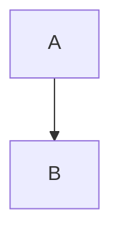

# How to Visualize Mermaid Diagrams

Quick guide to viewing the architecture diagrams in [docs/diagrams/](.).

---

## 🚀 Quick Start (3 Methods)

### Method 1: Mermaid Live Editor ⭐ RECOMMENDED

**Fastest way to view diagrams right now:**

1. **Open Mermaid Live Editor:**
   - Go to: https://mermaid.live

2. **Copy diagram content:**
   ```bash
   # From terminal
   cat docs/diagrams/architecture-overview.mermaid

   # Or open in VS Code and copy all
   ```

3. **Paste into editor:**
   - Left panel: Paste the code
   - Right panel: See instant preview
   - Click "Actions" → "Export SVG/PNG" to save

**Try it now with Architecture Overview:**
```bash
cat docs/diagrams/architecture-overview.mermaid | xclip -selection clipboard
# Then paste at https://mermaid.live
```

---

### Method 2: VS Code Extension ⭐ BEST FOR DEVELOPMENT

**Install once, view anytime in VS Code:**

1. **Install Extension:**
   - Open VS Code
   - Press `Ctrl+Shift+X` (Extensions)
   - Search: "Bierner.markdown-mermaid"
   - Install "Markdown Preview Mermaid Support"

2. **View Diagrams:**
   - Open any `.mermaid` file
   - Press `Ctrl+Shift+V` (Preview)
   - OR Right-click → "Open Preview to the Side"

3. **Alternative Extension Options:**
   - "Mermaid Preview" by vstirbu
   - "Markdown Preview Enhanced" (supports Mermaid)

**Keyboard Shortcuts:**
```
Ctrl+Shift+V : Toggle preview
Ctrl+K V     : Open preview to side
```

---

### Method 3: GitHub (Online) ⭐ BEST FOR SHARING

**If you have git access:**

1. **Commit and push diagrams:**
   ```bash
   git add docs/diagrams/*.mermaid
   git commit -m "docs: Add architecture diagrams"
   git push
   ```

2. **View on GitHub:**
   - Navigate to repository on GitHub
   - Go to `docs/diagrams/` folder
   - Click any `.mermaid` file
   - GitHub automatically renders it ✨

**No setup needed!** GitHub has built-in Mermaid support.

---

## 📖 Detailed Method Guides

### Option A: Browser-Based Viewers

#### 1. Mermaid Live Editor (https://mermaid.live)

**Pros:**
- ✅ No installation needed
- ✅ Instant preview
- ✅ Export to PNG/SVG/PDF
- ✅ Share via URL
- ✅ Edit and preview live

**Steps:**
1. Open https://mermaid.live
2. Delete default code
3. Copy your `.mermaid` file content
4. Paste into left panel
5. See rendered diagram on right

**Export Options:**
- Actions → Export SVG (best quality, scalable)
- Actions → Export PNG (for presentations)
- Actions → Copy markdown (for embedding)
- Actions → Copy to clipboard

#### 2. Mermaid Chart (https://www.mermaidchart.com)

**Pros:**
- ✅ Professional diagram editor
- ✅ Save diagrams to cloud
- ✅ Collaboration features
- ✅ Version history

**Steps:**
1. Go to https://www.mermaidchart.com
2. Sign up (free account)
3. Create new diagram
4. Paste code
5. Save and share

---

### Option B: Command Line Tools

#### 1. Mermaid CLI (Node.js)

**Install:**
```bash
npm install -g @mermaid-js/mermaid-cli
```

**Convert to PNG:**
```bash
mmdc -i docs/diagrams/architecture-overview.mermaid -o architecture-overview.png
```

**Convert all diagrams:**
```bash
for file in docs/diagrams/*.mermaid; do
  mmdc -i "$file" -o "${file%.mermaid}.png"
done
```

**Options:**
```bash
mmdc -i input.mermaid -o output.png -t dark     # Dark theme
mmdc -i input.mermaid -o output.svg             # SVG output
mmdc -i input.mermaid -o output.pdf             # PDF output
mmdc -i input.mermaid -o output.png -w 1920     # Set width
```

#### 2. Docker-based Mermaid CLI

**No Node.js needed:**
```bash
docker run --rm -v $(pwd):/data minlag/mermaid-cli \
  -i /data/docs/diagrams/architecture-overview.mermaid \
  -o /data/architecture-overview.png
```

---

### Option C: IDE/Editor Integration

#### 1. VS Code Extensions

**Option A: Markdown Preview Mermaid Support**
```
Extension ID: bierner.markdown-mermaid
Install: code --install-extension bierner.markdown-mermaid
```

**Usage:**
- Open `.md` file with mermaid code blocks
- Press `Ctrl+Shift+V` to preview
- Diagrams render automatically

**Option B: Mermaid Markdown Syntax Highlighting**
```
Extension ID: bpruitt-goddard.mermaid-markdown-syntax-highlighting
```

**Option C: Mermaid Preview**
```
Extension ID: vstirbu.vscode-mermaid-preview
```

**Usage:**
- Right-click `.mermaid` file
- "Preview Mermaid Diagram"

#### 2. JetBrains IDEs (IntelliJ, PyCharm, WebStorm)

**Install Plugin:**
- Settings → Plugins
- Search "Mermaid"
- Install "Mermaid" plugin

**Usage:**
- Open `.mermaid` file
- Click preview icon
- View rendered diagram

#### 3. Sublime Text

**Install Package:**
- Package Control → Install Package
- Search "Mermaid"
- Install "Mermaid Syntax Highlighting"

---

### Option D: Documentation Platforms

#### 1. MkDocs Material

**Install:**
```bash
pip install mkdocs-material
pip install mkdocs-mermaid2-plugin
```

**Configure (`mkdocs.yml`):**
```yaml
plugins:
  - mermaid2

markdown_extensions:
  - pymdownx.superfences:
      custom_fences:
        - name: mermaid
          class: mermaid
          format: !!python/name:pymdownx.superfences.fence_code_format
```

**Usage in Markdown:**
````markdown

````

#### 2. Docusaurus

**Install:**
```bash
npm install @docusaurus/theme-mermaid
```

**Configure (`docusaurus.config.js`):**
```javascript
module.exports = {
  themes: ['@docusaurus/theme-mermaid'],
  markdown: {
    mermaid: true,
  },
};
```

#### 3. GitBook

**Built-in Mermaid support:**
````markdown

````

#### 4. Notion

**Use Embed Block:**
1. Create diagram at https://mermaid.live
2. Actions → Copy link
3. In Notion: `/embed` → Paste link

---

## 🎨 Export and Share Options

### Export as Image Files

**Method 1: Mermaid Live Editor**
1. Open diagram at https://mermaid.live
2. Actions → Export → Choose format:
   - SVG (recommended for quality)
   - PNG (for presentations)
   - PDF (for documents)

**Method 2: Mermaid CLI**
```bash
# PNG with transparent background
mmdc -i diagram.mermaid -o diagram.png -b transparent

# High DPI for presentations
mmdc -i diagram.mermaid -o diagram.png -w 3840 -H 2160

# PDF for printing
mmdc -i diagram.mermaid -o diagram.pdf
```

### Share as Links

**Method 1: Mermaid Live Editor**
1. Paste diagram code at https://mermaid.live
2. Actions → Copy link
3. Share URL (diagram encoded in URL)

**Example:**
```
https://mermaid.live/edit#pako:eNpVjstqw0AMRX9F6KUJ...
```

**Method 2: GitHub**
1. Commit `.mermaid` file to GitHub
2. Share repository link
3. GitHub renders it automatically

---

## 🖥️ Local Web Server Viewer

**Create HTML viewer:**

```html
<!-- viewer.html -->
<!DOCTYPE html>
<html>
<head>
  <script src="https://cdn.jsdelivr.net/npm/mermaid/dist/mermaid.min.js"></script>
</head>
<body>
  <div class="mermaid">
    <!-- Paste your Mermaid code here -->
    graph TB
        A --> B
  </div>
  <script>
    mermaid.initialize({ startOnLoad: true });
  </script>
</body>
</html>
```

**Open in browser:**
```bash
python3 -m http.server 8080
# Visit http://localhost:8080/viewer.html
```

---

## 📱 Mobile Viewing

### iOS/Android

**Method 1: GitHub App**
- Install GitHub mobile app
- Navigate to diagram file
- View rendered diagram

**Method 2: Mermaid Live (Mobile Browser)**
- Open https://mermaid.live in Safari/Chrome
- Paste diagram code
- View on mobile

---

## 🔧 Troubleshooting

### Diagram Not Rendering

**Issue: Syntax errors**
```bash
# Validate syntax at https://mermaid.live
# Check for:
- Missing quotes around labels
- Unmatched brackets
- Invalid node IDs
```

**Issue: Special characters**
```mermaid
# ❌ Wrong
A["Label with "quotes""]

# ✅ Correct
A["Label with quotes"]
```

### VS Code Preview Not Working

**Fix:**
1. Reload VS Code: `Ctrl+Shift+P` → "Reload Window"
2. Check extension is enabled
3. Try different extension (Markdown Preview Enhanced)

### CLI Export Fails

**Fix:**
```bash
# Install Chromium (required by mermaid-cli)
npm install -g puppeteer

# Or use Docker version (no dependencies)
docker pull minlag/mermaid-cli
```

---

## 💡 Best Practices

### For Development
- **Use VS Code extension** for quick iteration
- Keep diagrams in git with code
- Preview changes before committing

### For Documentation
- **Export to SVG** for web documentation
- Use PNG for presentations (high DPI)
- Embed in Markdown docs

### For Collaboration
- **Share via GitHub** for team review
- Use Mermaid Live links for quick sharing
- Export PDF for stakeholder presentations

---

## 📚 Quick Reference

### Viewing Our Diagrams

```bash
# Option 1: VS Code
code docs/diagrams/architecture-overview.mermaid
# Then: Ctrl+Shift+V

# Option 2: Mermaid Live Editor
cat docs/diagrams/architecture-overview.mermaid
# Copy output, paste at https://mermaid.live

# Option 3: Export to PNG
mmdc -i docs/diagrams/architecture-overview.mermaid \
     -o architecture-overview.png

# Option 4: GitHub (after push)
git add docs/diagrams/*.mermaid
git commit -m "docs: Add diagrams"
git push
# View on GitHub
```

### Available Diagrams

```
✅ architecture-overview.mermaid       - System architecture
✅ job-submission-flow.mermaid         - Job workflow
✅ authentication-flow.mermaid         - Auth flow
✅ michigan-api-integration.mermaid    - Michigan API
✅ deployment-status.mermaid           - Current status
```

---

## 🎯 Recommended Workflow

### For Quick Viewing
1. Copy diagram content
2. Go to https://mermaid.live
3. Paste and view

### For Development
1. Install VS Code extension (one-time)
2. Open `.mermaid` files in VS Code
3. Press `Ctrl+Shift+V` to preview

### For Sharing
1. Commit to GitHub
2. Share repository link
3. GitHub renders automatically

---

## 🔗 Helpful Resources

**Official Documentation:**
- Mermaid Docs: https://mermaid.js.org/
- Syntax Reference: https://mermaid.js.org/intro/
- Examples: https://mermaid.js.org/syntax/examples.html

**Tools:**
- Mermaid Live Editor: https://mermaid.live
- Mermaid CLI: https://github.com/mermaid-js/mermaid-cli
- VS Code Extension: https://marketplace.visualstudio.com/items?itemName=bierner.markdown-mermaid

**Community:**
- GitHub Discussions: https://github.com/mermaid-js/mermaid/discussions
- Discord: https://discord.gg/AgrbSrBer3

---

**Last Updated:** 2025-10-06
**Created By:** Development Team

**Need help?** Open an issue or check the [main README](../../README.md).
